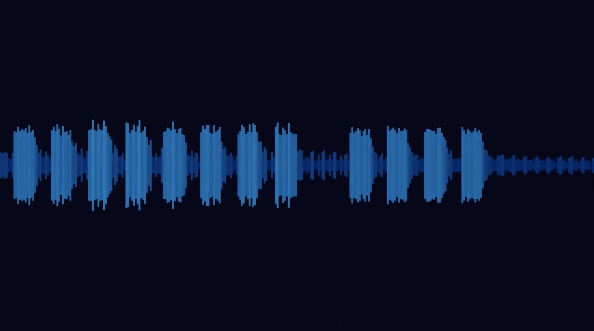

# wavegen 🎵➡️📼

turns your audio files into waveform videos.

## wait what does it do?

you give it an mp3 (or wav, flac, ogg, whatever). it draws those wavy bars that go up and down with the music. then wraps it in an mp4 with the original audio.

like those old winamp visualizers but in video form.

## screenshoot



## deps

- **Rust** (obviously. get it from rustup if u don't have it)
- **ffmpeg** (needs to be on your PATH. the program pipes raw frames to it)

   ```bash
   # macos
   brew install ffmpeg

   # ubuntu/debian
   sudo apt install ffmpeg

   # check if u already have it
   ffmpeg -version
   ```

## build

```bash
git clone <this-repo> && cd wavegen
cargo build --release
```

or just run it straight away without building separately:

```bash
cargo run --release -- -i music.mp3
```

(release flag makes it faster btw)

## usage

```bash
# basic
cargo run --release -- -i song.mp3

# custom output name
cargo run --release -- -i song.mp3 -o my_video.mp4

# crank up the fps
cargo run --release -- -i song.mp3 -r 60

# go crazy
cargo run --release -- -i song.mp3 -r 120 --width 1920 --height 1080

# skinny bars
cargo run --release -- -i song.mp3 --bar-width 2

# show more of the waveform at once
cargo run --release -- -i song.mp3 --window 4
```

## options

| flag              | default    | what it does                              |
|-------------------|------------|-------------------------------------------|
| `-i` / `--input`  | —          | your audio file (mp3, wav, flac, etc.)    |
| `-o` / `--output` | output.mp4 | where to save the video                   |
| `-r` / `--fps`    | 30         | frames per second. 60 is smooth, 120+ is overkill but works |
| `--width`         | 1280       | video width                               |
| `--height`        | 720        | video height                              |
| `--bar-width`     | 4          | how wide each amplitude bar is (pixels)   |
| `--window`        | 2          | seconds of audio visible on screen at once |

## how it works (quick & dirty)

1. **decode** the audio with `symphonia` → gives us raw PCM numbers
2. **render** each frame as raw RGB24 pixels (blue/yellow bars on dark bg)
3. **pipe** those pixels straight into `ffmpeg`'s stdin
4. ffmpeg encodes h.264 video + aac audio, spits out an mp4

no temp files. no pngs. all in memory.

## supported audio formats

mp3, wav, flac, ogg, mkv (audio tracks), pcm — basically anything symphonia can eat.

## known quirks

- first run might take a while (rust compiling stuff). subsequent runs are fast.
- high fps + long songs = lots of frames. your cpu will let u know.
- if you get "ffmpeg not found" — u need to install ffmpeg (see deps above).

## license

do whatever u want idc
